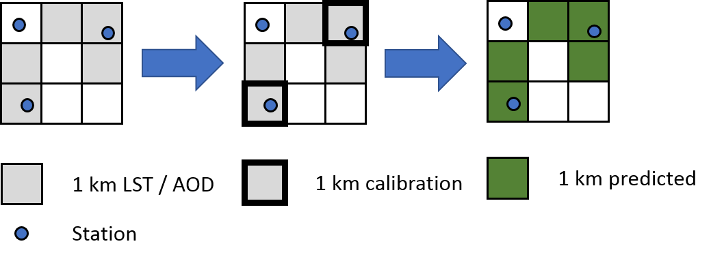
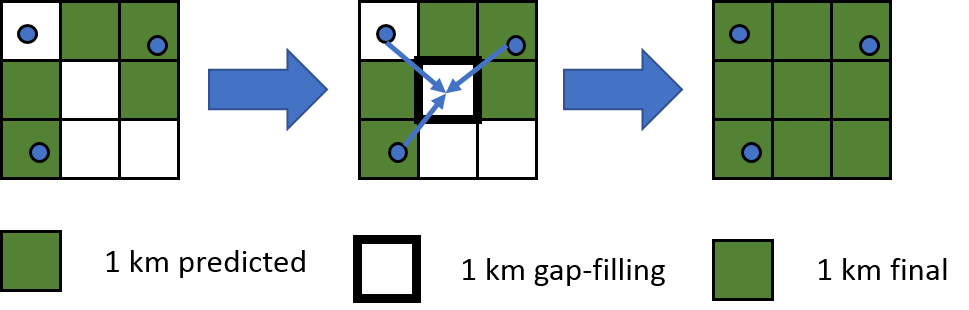

# Climate change, air pollution, and perinatal health

### Ian Hough

.pull-left[
### Dr. Johanna Lepeule

Institute for Advanced Biosciences

University Grenoble Alpes
]

.pull-right[
### Dr. Itai Kloog

Department of Geography and Environmental Development

Ben Gurion University of the Negev
]

.logos[  ]

---
background-image: url(/img/outline-black.png)

```{r, load_refs, echo=FALSE, cache=FALSE}
library(RefManageR)
BibOptions(
  bib.style = "authoryear",
  check.entries = FALSE,
  dashed = FALSE,
  hyperlink = FALSE,
  max.names = 1,
  style = "text"
)
bib <- ReadBib("references.bib")
```

---

# Adverse birth outcomes

### Preterm birth (<37 weeks gestation)

* 11% of all births and increasing `r Cite(bib, "Harrison2016")`
* Leading cause of child mortality `r Cite(bib, "Liu2016")`
* Sequalae in childhood and adulthood `r Cite(bib, "McCormick2011")`
  - Asthma, cerebral palsy, behavioural problems, etc.

### Term low birth weight (<2500 g)

* Increased morbidity and mortality in childhood & adulthood `r Cite(bib, c("Barker2004", "Belbasis2016"))`

---

# Ambient temperature (T<sub>a</sub>) and health

* Heat, cold, or variable T<sub>a</sub> can increase risk `r Cite(bib, "Zhang2017")`

* Response may depend on local population & climate

* Hard to synthesize findings

|           | Preterm birth     | Birth weight      | Term low birth weight |
|-----------|-------------------|-------------------|-----------------------|
| Exposure  | Cold (<10th %ile) | IQR Ta increase   | Heat (>95th %ile)     |
| Window    | Weeks 1–7         | Last 30 days      | Trimester 3           |
| Statistic | Relative risk     | Decrease          | Odds ratio            |
| Effect    | 1.09 [1.04–1.15]  | 16.6 g [5.9–27.4] | 1.31 [1.15–1.49]      |
| Reference | `r Citet(bib, "Ha2017a")` | `r Citet(bib, "Kloog2015")` | `r Citet(bib, "Ha2017b")` |

---
class: inverse center middle

# How do we estimate T<sub>a</sub> exposure?

---
background-image: url(/img/map_stations.jpg)
background-size: contain
class: inverse

---
background-image: url(/img/map_stations_zoom.jpg)
background-size: contain
class: inverse

---

# Exposure error

* ### Sparse monitoring networks
* ### Coarse gridded meteorological data

### &rarr; May bias effect estimates towards null

---

# Our T<sub>a</sub> model

* ### Daily minimum, maximum, and mean T<sub>a</sub> 2000 - 2016
* ### 1 x 1 km<sup>2</sup> for continental France
* ### 200 x 200 m<sup>2</sup> for large urban areas

<br>

Extension of `r Cite(bib, "Kloog2017")` (daily 1 km mean T<sub>a</sub> 2000 - 2011)

---

# Model components

### 1. Spatiotemporal and spatial predictors

* Land Surface Temperature (LST), elevation, etc.

### 2. Linear mixed model

* T<sub>a</sub> ~ LST with daily varying slope

### 3. Gapfilling

* T<sub>pred</sub> ~ T<sub>a</sub> at nearby stations

### 4. Local interpolation of residuals

* High spatial resolution predictors + machine learning ensemble

---

# Satellite data

### MODIS (1 km)

* Land Surface Temperature (LST)
  * Terra: 10:30 / 22:30 (day / night)
  * Aqua: 13:30 / 01:30 (day / night)
* NDVI
  * Monthly composite

### Landsat 5 / 7 / 8 (30 m)

* Top-of-atmosphere brightness temperature (T<sub>B</sub>)
* NDVI
* &uarr; composited by month across 2000 - 2016

---

# Spatial predictors

* ### Elevation
* ### Land cover
* ### Population
* ### Climatic regions

&uarr; Aggregated to 1 km and 200 m grids

---

# Stage 1: linear mixed model (1 km)



$$T_a = (\alpha + \mu_{jr}) + (\beta_1 + \nu_{jr}) \cdot LST + \beta_2 \cdot Emissivity + \\
\; \; \; \; \; \; \; \; \beta_3 \cdot NDVI + \beta_4 \cdot Elevation + \beta_5 \cdot Population + \\
\; \; \; \; \; \; \; \; \beta_6 \cdot Land Cover + e$$

*j* = day &nbsp; *r* = climatic region &nbsp; *e* = error


---

# Stage 2: Gapfilling



$$T_{pred} = (\alpha + \mu_{ip}) + (\beta_1 + \nu_{ip}) \cdot T_{IDW} + e$$

*i* = grid cell

*p* = two-month period

*T<sub>IDW</sub>* = inverse distance weighted T<sub>a</sub>

---
background-image: url(/img/map_ta_1km.jpg)
background-size: contain
class: inverse

---

# 1 km model performance

### Cross-validated 1 km predictions (calibration stage)

| 2000-2016          | R2   | RMSE | MAE | Spatial R2 | Spatial RMSE | Temporal R2 | Temporal RMSE |
|--------------------|------|------|-----|------------|--------------|-------------|---------------|
| T<sub>a</sub> min  | 0.92 |  1.9 | 1.4 |       0.89 |          1.1 |        0.94 |           1.6 |
| T<sub>a</sub> mean | 0.97 |  1.3 | 0.9 |       0.95 |          0.8 |        0.97 |           1.2 |
| T<sub>a</sub> max  | 0.95 |  1.8 | 1.4 |       0.88 |          1.2 |        0.96 |           1.5 |

### Previous model `r Cite(bib, "Kloog2017")`

| 2000-2011          | R2   | RMSE | MAE | Spatial R2 | Spatial RMSE | Temporal R2 | Temporal RMSE |
|--------------------|------|------|-----|------------|--------------|-------------|---------------|
| T<sub>a</sub> mean | 0.95 |  1.5 |   * |       0.91 |         0.65 |        0.96 |             * |

\* = not reported

---
background-image: url(/img/map_stations_zoom.jpg)
background-size: contain
class: inverse

---
background-image: url(/img/map_ta_1km_zoom.jpg)
background-size: contain
class: inverse

---

# Stage 3: Residual interpolation (200 m)

### Contiguous urban areas with > 50,000 inhabitants

### Random forest and XGBoost models

$$R \sim T_{pred},\ T_{B},\ NDVI,\ Elevation,\ Population,\\Land Cover,\ lat,\ lon,\ day$$

### GAM ensemble

* Weights vary by location and predicted residual

---
background-image: url(/img/map_ta_1km_zoom.jpg)
background-size: contain
class: inverse

---
background-image: url(/img/map_ta_200m.jpg)
background-size: contain
class: inverse

---

# 200 m model performance

### Cross-validated 200 m ensemble predictions (residual scale)

| 2000-2016        | R2   | RMSE | MAE  | Spatial R2 | Spatial RMSE | Temporal R2 | Temporal RMSE |
|------------------|------|------|------|------------|--------------|-------------|---------------|
| R<sub>min</sub>  | 0.79 |  0.6 |  0.4 |        1.0 |         0.05 |        0.66 |           0.6 |
| R<sub>mean</sub> | 0.89 |  0.4 |  0.3 |        1.0 |         0.04 |        0.87 |           0.4 |
| R<sub>max</sub>  | 0.85 |  0.5 |  0.3 |        1.0 |         0.03 |        0.73 |           0.5 |

---

# Next steps

### Fine particulate matter models (PM<sub>10</sub> & PM<sub>2.5</sub>)

* Similar to T<sub>a</sub> model
* MODIS aerosol optical depth (AOD)

### Birth outcomes study

* EDEN, PELAGIE, SEPAGES
* Birth weight and preterm birth
* T<sub>a</sub>, PM, and interaction

---
class: inverse bottom center

# Thanks!

<br><br><br><br>

.left[
### Ian Hough
### ian.hough@univ-grenoble-alpes.fr
]

---
class: inverse references-slide

# References

```{r, echo=FALSE, results='asis'}
PrintBibliography(bib)
```
